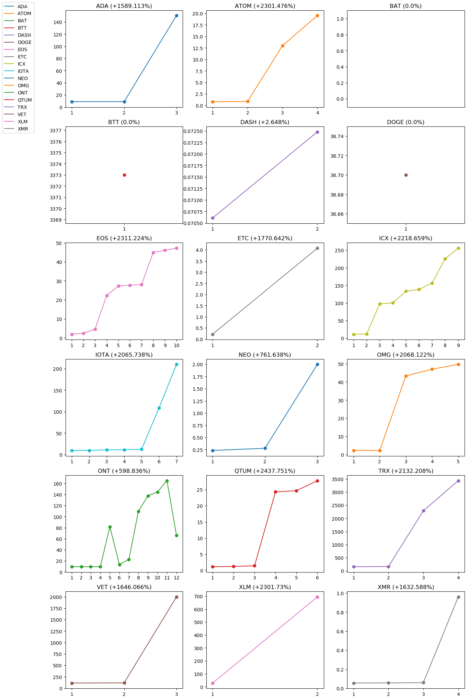

# Coin Progress Chart and Database Backup plugin for Binance Trade Bot

This is a program tool based on [Binance Trade Bot].

The intent of this bot is to retrieve the local database trade infomation, e.g. the orders since last database reset, and store it for several plottings. If you have also a Telegram Bot account, it will automaticaly connect to it send the results.
To operate the bot creates a backup of the database to not interfere with the main bot

## Install

Create the file `config` based on `config.example`.
Insert your path to Binance Trade Bot in `bot_path=`

Then run
```
pip3 install -r requirements.txt
```

## Usage

It is possible to generate chart with data retrieved from Binance:

```bash
python3 -m binance-chart-plugin-telegram-bot -bn
```


As alternative it is possible to use data retrieved from bot database:

```bash
python3 -m binance-chart-plugin-telegram-bot -db
```

## Telegram 

The output can be sent to an external service. It detectes the APPRISE file in the bot folder and connect automatically to it 

## Output example


<p align="center">
  
</p>


ADA: 8.91 -> 150.5 (+1589.113%)
ATOM: 0.813 -> 19.524 (+2301.476%)
BAT: N.A.
BTT: N.A.
DASH: 0.07061 -> 0.07248 (+2.648%)
DOGE: N.A.
EOS: 1.96 -> 47.26 (+2311.224%)
ETC: 0.218 -> 4.078 (+1770.642%)
ICX: 11.04 -> 255.98 (+2218.659%)
IOTA: 9.69 -> 209.86 (+2065.738%)
NEO: 0.232 -> 1.999 (+761.638%)
OMG: 2.29 -> 49.65 (+2068.122%)
ONT: 9.45 -> 66.04 (+598.836%)
QTUM: 1.094 -> 27.763 (+2437.751%)
TRX: 154.0 -> 3437.6 (+2132.208%)
VET: 114.4 -> 1997.5 (+1646.066%)
XLM: 28.9 -> 694.1 (+2301.73%)
XMR: 0.05542 -> 0.9602 (+1632.588%)

**Note** : The data shown are not from your binance account. This program is a tool for [Binance Trade Bot] aimed to analize the bot behaviours since the last reset.


[binance trade bot]: https://github.com/edeng23/binance-trade-bot