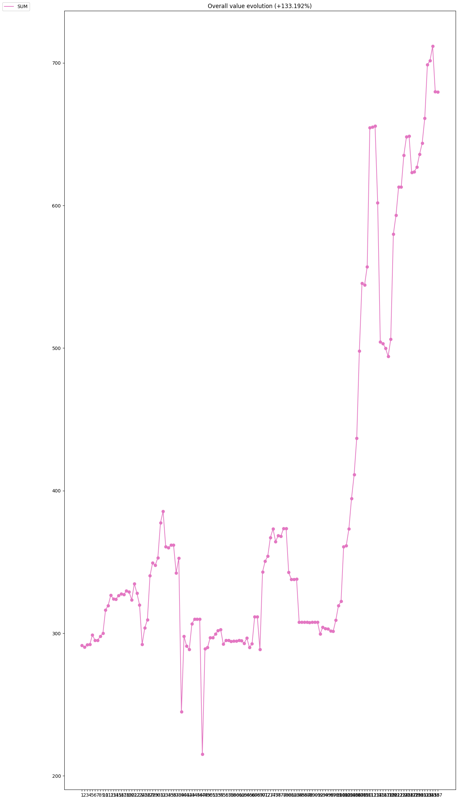

# Coin Progress Chart and Database Backup plugin for Binance Trade Bot

This is a program tool based on [Binance Trade Bot].

The intent of this bot is to retrieve the local database trade infomation, e.g. the orders since last database reset, and store it for several types of plottings and text outputs. If you have also a Telegram Bot account, it will automaticaly connect to it send the results.
To operate the bot creates a backup of the database to not interfere with the main bot

## Install

Create the file `config` based on `config.example`.

`
[config]
Bot path\n
bot_path=your/path/to/binance-trade-bot
Datetime format: YYYY-MM-DD\n
min_datetime = 0
Display coin value for each coin \n
enable_coin_value = 1
Display Fiat evolution graph \n
enable_fiat_evolution = 1
`

Then run
```
pip3 install -r requirements.txt
```

## Usage

Tt is possible to use data retrieved from bot database, it generates three plots: all the coin amount progress, all the coin valure progress, the overall value of current coin.
The last two graphs are printed only if `enable_coin_value` and `enable_fiat_evolution` are set to 1, 0 otherwise:

```bash
python3 -m binance-chart-plugin-telegram-bot -db
```

As alternative tt is possible to generate chart with data retrieved from Binance [WIP - shows only all coin progress of coin list]:

```bash
python3 -m binance-chart-plugin-telegram-bot -bn
```

## Telegram 

The output can be sent to an external service. It detectes the APPRISE file in the bot folder and connect automatically to it.

## Output example


<p align="center">
  
</p>

<p align="center">
  
</p>

Summary sent as message:
```
Coin amount
ATOM: +33.807% 
ADA: +68.088% 
BAT: +110.986% 
BTT: +84.621% 
CAKE: +9.986% 
DASH: +27.212% 
SOL: +54.906% 
EOS: +94.184% 
ETC: +72.531% 
ICX: +42.828% 
IOTA: +75.491% 
NEO: +16.123% 
OMG: +49.507% 
ONT: -29.614% 
QTUM: +27.982% 
ROSE: +8.613% 
TRX: +51.156% 
VET: +71.316% 
XMR: +34.778% 

Coin value
ATOM: -10.524% 
ADA: +49.92% 
BAT: +130.296% 
BTT: +6.053% 
CAKE: +19.776% 
DASH: -10.105% 
SOL: +10.68% 
EOS: +128.894% 
ETC: +120.774% 
ICX: +16.264% 
IOTA: +3.663% 
NEO: +18.429% 
OMG: +7.387% 
ONT: -27.752% 
QTUM: -19.113% 
ROSE: +1.673% 
TRX: +122.067% 
VET: +3.275% 
XMR: +62.788% 

FIAT evolution: +133.192%
```

**Note** : This program is a tool for [Binance Trade Bot] aimed to analize the bot behaviours since the last reset. The binance coin progress evaluation feature is still work in progress.


[binance trade bot]: https://github.com/edeng23/binance-trade-bot
